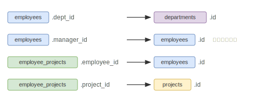

# Chapter 05: JOIN

## このチャプターで学ぶこと

- `INNER JOIN` による内部結合
- `LEFT JOIN` による外部結合
- 複数テーブルの結合
- `CROSS JOIN`（直積）とカンマ記法
- 自己結合（self join）

---

## 使用するテーブル

このチャプターでは全テーブルを使います。

**employees**（id, name, dept_id, salary, hire_date, manager_id）
**departments**（id, name, location）
**projects**（id, name, start_date, end_date, budget）
**employee_projects**（employee_id, project_id, role）

テーブル間の関係：



---

## 基礎知識

> **例で使うテーブルについて:** 以下の例では架空の `books`（書籍）・`genres`（ジャンル）・`reviews`（レビュー）テーブルを使います。演習問題で使うテーブルとは異なりますが、JOIN の書き方は同じです。

### 1. INNER JOIN

**両方のテーブルに一致する行だけ**を結合します。どちらかにしか存在しない行は除外されます。

まず、結合前の2つのテーブルを見てみましょう（抜粋）。

**books（左テーブル）**

| id | title          | genre_id |
|----|----------------|----------|
| 1  | SQL入門        | 1        |
| 2  | Python基礎     | 1        |
| 7  | 料理の基礎     | **NULL** |

**genres（右テーブル）**

| id | name         |
|----|--------------|
| 1  | プログラミング |
| 4  | 料理          |

`ON b.genre_id = g.id` で結合すると、`genre_id = 1` の SQL入門・Python基礎だけが一致します。
料理の基礎（genre_id が NULL）と料理（id=4 の書籍がない）は**どちらも除外**されます。

**INNER JOIN の結果**

| title      | ジャンル名       |
|------------|----------------|
| SQL入門    | プログラミング   |
| Python基礎 | プログラミング   |

```sql
SELECT b.title, g.name AS ジャンル名
FROM books b
INNER JOIN genres g ON b.genre_id = g.id;
```

> テーブルに別名（エイリアス）をつけると、カラム名の衝突を避けられます（`b`、`g`）。

> `JOIN` だけ書いた場合も `INNER JOIN` と同じ意味です。本教材では明示的に `INNER JOIN` と書きます。

### 2. LEFT JOIN

**左テーブルの全行を保持**し、右テーブルに一致する行がなければ NULL で埋めます。
右テーブルだけにある行（料理ジャンル）は含まれません。

同じ2テーブルを LEFT JOIN すると：

**LEFT JOIN の結果**

| title          | ジャンル名       |
|----------------|----------------|
| SQL入門        | プログラミング   |
| Python基礎     | プログラミング   |
| 料理の基礎     | **NULL**        |

料理の基礎は右テーブルに一致するジャンルがないため `NULL` になりますが、**行自体は残ります**。

```sql
SELECT b.title, g.name AS ジャンル名
FROM books b
LEFT JOIN genres g ON b.genre_id = g.id;
```

#### INNER JOIN と LEFT JOIN の違いまとめ

| 状況                                     | INNER JOIN | LEFT JOIN |
|------------------------------------------|-----------|-----------|
| 両テーブルに一致あり（SQL入門）           | 含まれる   | 含まれる   |
| 左だけに存在（料理の基礎、genre_id=NULL） | **除外**   | 含まれる（ジャンル名=NULL） |
| 右だけに存在（料理ジャンル、書籍なし）    | 除外       | 除外       |

### 3. 複数テーブルの結合

`JOIN` を連続して書くことで、3テーブル以上を結合できます。

```sql
SELECT c.name AS 顧客名, b.title AS 書籍名, r.rating
FROM customers c
INNER JOIN reviews r ON c.id = r.customer_id
INNER JOIN books b   ON r.book_id = b.id;
```

### 4. CROSS JOIN（直積）とカンマ記法

`CROSS JOIN` は `ON` 句を持たず、**左右のテーブルの全行の組み合わせ（直積）**を返します。
左3行・右2行なら 3×2=6行になります。

```sql
SELECT a.name, b.name
FROM table_a a
CROSS JOIN table_b b;
```

FROM 句でカンマ区切りに並べる書き方は `CROSS JOIN` と同じ意味です。

```sql
-- 上と同じ結果
SELECT a.name, b.name
FROM table_a a, table_b b;
```

> **注意:** 両テーブルの行数が多い場合、結果が膨大になります。  
> 通常の結合には `INNER JOIN` / `LEFT JOIN` を使いましょう。

このカンマ記法は、**片方が必ず1行だけ返す** CTE（Chapter 09 で登場）と組み合わせると便利です。
1行との CROSS JOIN は行数が増えないため、スカラー値を全行に付加する目的で使われます。

---

### 5. 自己結合

同じテーブルを2回使って結合します。親子関係や上司・部下の関係を取得するときに使います。
テーブルエイリアスで区別します。

```sql
-- categories テーブル（id, name, parent_id）を自己結合
SELECT c.name AS カテゴリ名, p.name AS 親カテゴリ名
FROM categories c
INNER JOIN categories p ON c.parent_id = p.id;
```

---

## 演習

---

### 問題 5-1: INNER JOIN

**ファイル:** `exercises/chapter05/ex01.sql`

`employees` と `departments` を結合し、**部署に所属している社員**の
`id`、`name`（社員名）、`departments.name`（部署名）、`salary` を取得してください。
`id` の昇順で並べてください。

**期待される結果（9行 — 昭二は部署 NULL のため除外）:**

| id | name  | 部署名         | salary |
|----|-------|---------------|--------|
| 1  | 花子  | 開発           | 75000  |
| 2  | 一郎  | 開発           | 60000  |
| 3  | 美子  | マーケティング  | 55000  |
| 4  | 悠介  | マーケティング  | 50000  |
| 5  | 由子  | 人事           | 65000  |
| 6  | 健太  | 開発           | 80000  |
| 7  | あかね | 営業          | 48000  |
| 9  | 京子  | 人事           | 58000  |
| 10 | 翔太  | 営業           | 52000  |

---

### 問題 5-2: LEFT JOIN

**ファイル:** `exercises/chapter05/ex02.sql`

`employees` と `departments` を **LEFT JOIN** で結合し、**全社員**の
`id`、`name`（社員名）、`departments.name`（部署名）、`salary` を取得してください。
`id` の昇順で並べてください。

**期待される結果（10行 — 昭二の部署名は NULL）:**

| id | name  | 部署名         | salary |
|----|-------|---------------|--------|
| 1  | 花子  | 開発           | 75000  |
| 2  | 一郎  | 開発           | 60000  |
| 3  | 美子  | マーケティング  | 55000  |
| 4  | 悠介  | マーケティング  | 50000  |
| 5  | 由子  | 人事           | 65000  |
| 6  | 健太  | 開発           | 80000  |
| 7  | あかね | 営業          | 48000  |
| 8  | 昭二  | NULL           | 45000  |
| 9  | 京子  | 人事           | 58000  |
| 10 | 翔太  | 営業           | 52000  |

---

### 問題 5-3: 3テーブル結合

**ファイル:** `exercises/chapter05/ex03.sql`

`employees`、`employee_projects`、`projects` の3テーブルを結合し、
**社員名**・**プロジェクト名**・**役割（role）** の一覧を取得してください。
社員名の昇順、同じ社員名ならプロジェクト名の昇順で並べてください。

> ※ PostgreSQL は日本語文字列をUnicodeコードポイント順で並べます。

**期待される結果（12行）:**

| 社員名 | プロジェクト名 | role     |
|--------|--------------|----------|
| あかね | 海外展開      | メンバー  |
| 一郎   | データ統合    | メンバー  |
| 一郎   | 基盤整備      | メンバー  |
| 京子   | データ統合    | メンバー  |
| 健太   | データ統合    | メンバー  |
| 健太   | 基盤整備      | メンバー  |
| 悠介   | 新規開拓      | メンバー  |
| 由子   | 海外展開      | リーダー  |
| 美子   | 新規開拓      | リーダー  |
| 翔太   | 海外展開      | メンバー  |
| 花子   | データ統合    | リーダー  |
| 花子   | 基盤整備      | リーダー  |

---

### 問題 5-4: 自己結合

**ファイル:** `exercises/chapter05/ex04.sql`

`employees` テーブルを自己結合し、**上司がいる社員**の
「社員名」と「上司名」を取得してください。社員名の昇順で並べてください。

**期待される結果（5行）:**

| 社員名 | 上司名 |
|--------|--------|
| 一郎   | 花子   |
| 京子   | 由子   |
| 健太   | 花子   |
| 悠介   | 美子   |
| 翔太   | あかね |

---

### 問題 5-5: JOIN + WHERE

**ファイル:** `exercises/chapter05/ex05.sql`

3テーブルを結合し、**現在も進行中のプロジェクト**（`end_date` が NULL）に
参加している社員の「社員名」と「役割」を取得してください。
役割の昇順、同じ役割なら社員名の昇順で並べてください。

**期待される結果（4行 — プロジェクト「データ統合」が該当）:**

| 社員名 | role    |
|--------|---------|
| 一郎   | メンバー |
| 京子   | メンバー |
| 健太   | メンバー |
| 花子   | リーダー |
